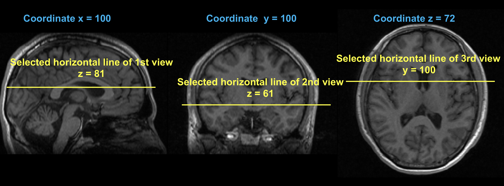
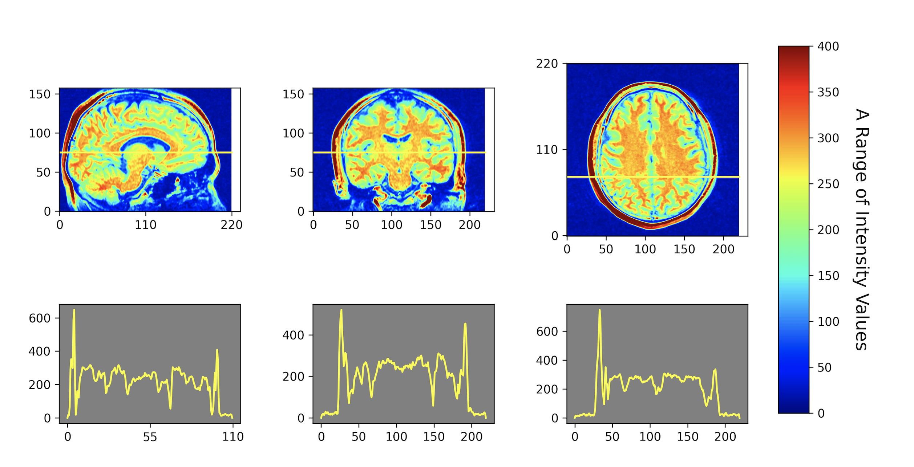

# <font size=6><br>_**ipPlot.py</br></font> <font size=3>(Intensity profile of MR images plotting script)**_</font>

## <font color=white>_Feature_</font>
<font size=4>Let's <font color=grean><b>_Draw_</b></font> the intensity profile of MR images and <font color=yellow><b>_Save_</b> </font> as a figure !!

## Description
+ Python3 based plotting script
+ The script is very simple to use
+ Outputs are "_Intensity Profile Figure_" of MR images (Sagittal, Coronal, Axial views)


## Install requirements
### &nbsp;&nbsp;&nbsp;_Modules_
&nbsp;&nbsp;&nbsp;&nbsp;
```python setup.py install```


## Usage
+ <b>Run in Terminal</b>
```
python ipPlot.py
```
+ <b> Just type _input arguments_</b>


+ You can decide above arguments as the following example


+ <b>Tips</b>
```
Please make sure dimension of your MR images
```


+ <b>Help</b>
```
python ipPlot.py --help
```

## Outputs
+ Intensity Profile Figure


## Version history
+ Version 0.10 : The script release (2020.08.04)

## _Contact for Feedback and Bug Reports_
_Uksu, Choi (qtwing@naver.com)_
